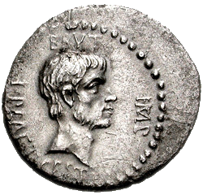
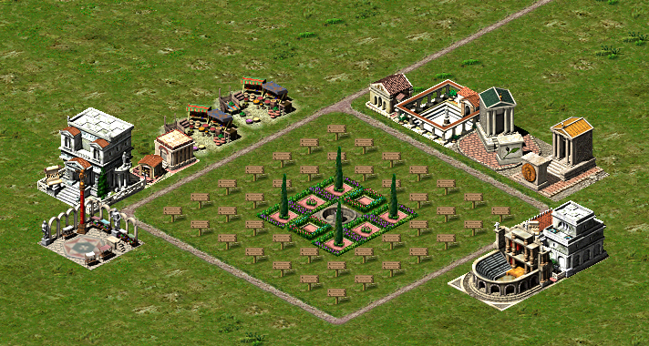
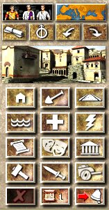

# Brutus 

Brutus is an attempt to find optimal housing block designs in Caesar III. It is a fork of [Julius](bvschaik/julius), an open source re-implementation of Caesar III (as a result, the executable is still called "julius", as are some source files).

Julius aims to faithfully recreate the same logic as the original game so any improved
housing blocks found with Brutus should work in Caesar III too.

## How it works

Brutus isn't trying to teach a computer to play Caesar III. Instead, it tackles the problem of how to get the most prosperity out of a given area. This is useful because prosperity is, in the later levels, the harder objective to meet.

There are already many good [housing block designs](https://caesar3.heavengames.com/strategy/housing/index.shtml) in use. However, these tend to favour simplicity and memorability over maximum prosperity. The 7x7 and 9x9 blocks, for example, minimise the number of fountains required (fountain reach is shorter in desert scenarios). Here is a "7x7" block, though it is more like 13x13 with roads and support buildings:

If we want to find the best housing block layout, we cannot try all of the possible arrangements. Considering only the one-tile buildings, there are bw x h possibilities, where b is the number of buildings, w the width of the area and h the height. A brute force approach to a 9x9 area with the basic houses, gardens, roads, security and healthcare structures would require about 1181 (≈2x1084) iterations. With each iteration taking in the region of 1 second, we could wait a long time for an answer. A more practical approach to finding an optimum in a large search space uses simulated annealing. Named after the analogous metalurgical process, simulated annealing finds an approximate optimum at far lower cost than an exhaustive search.

Although implementation details differ, the basic process followed is:

1. Choose a starting configuration. In our case, this is a rectangular grid where each tile contains a road, a "building" (including gardens, fountains, etc.), a housing plot or empty land.
1. Measure the prosperity of the configuration. Do this by running the game for several in-game months and then taking the sum of the prosperity value of each house. Convert this to a cost or "energy" value, where energy is inversely proportional to prosperity.
1. Randomly change the configuration. For example, pick a building at random and place it at a random spot in the area.
1. Measure the energy of the new configuration (again by running the game, summing the prosperities and converting to energy). If it is lower than the previous one, use this configuration as the starting point for the next permutation. If it is higher, use it anyway with some probility p = e-(Ei+1-Ei)/kT, where k is the Boltzmann constant and T is our "temperature".
1. Lower our "temperature". If we have reached our finishing temp, stop. Otherwise, repeat from 3.

## How to anneal an area

Brutus requires the original assets (graphics, sounds, etc) from Caesar 3 to run.
It optionally [supports the high-quality MP3 files](doc/mp3_support.md) once provided on the
Sierra website.

After you have built brutus (see [Building Brutus](#Building-Brutus)), choose either the drag tool or command line option below.

### Drag tool option

1. Run Brutus (without the `--anneal` option) and either start a new game or load a saved one.

1. Click the "Go to trouble spots" button in the bottom right corner of the toolbox. We have hijacked this icon for annealing purposes. Your mouse icon will change to look like a garden tile.

    

1. Drag over the area you wish to anneal. You should start in the North West corner of the area and drag to the South East.

1. When you release the mouse button, annealing will begin.

If there are buildings already in the area, they will be used as the starting configuration. The game will
be paused once annealing is complete.

### Command line option

1. Choose the area of a map you would like to anneal.
1. Set the map name and area co-ordinates in the `main_loop` function of [src/platform/julius.c](src/platform/julius.c).
1. Recompile.
1. Run `$ julius --anneal`.

The game will be paused once annealing is complete.
<!-- Is this correct or does it save and exit? -->

## Building Brutus

Building Brutus is largely the same as Julius but with a couple of extra dependencies. See the [Building doc](doc/BUILDING.md) for instructions.

Note that, unlike Julius, Brutus does not currently support PS Vita or Nintendo Switch.

Once Brutus has been built, you can either copy the game to the Caesar 3 folder, or run the game from an independent
folder, in which case the game will ask you to point to the Caesar 3 folder.

Note that you must have permission to write in the game data directory as the saves will be
stored there.

See [Running](doc/RUNNING.md) for further instructions and startup options.

## Development

### Pre-commit checks

- Lint Markdown files
- Lint source files with cpplint
- Ensure that Brutus builds without errors
- Run `make test` from the debug/ folder
- Run `./test/annealing_tests` from the debug folder

## Acknowledgements

The Brutus coin photograph is by Classical Numismatic Group, Inc. <http://www.cngcoins.com>, CC BY-SA 2.5, <https://commons.wikimedia.org/w/index.php?curid=90580676>
